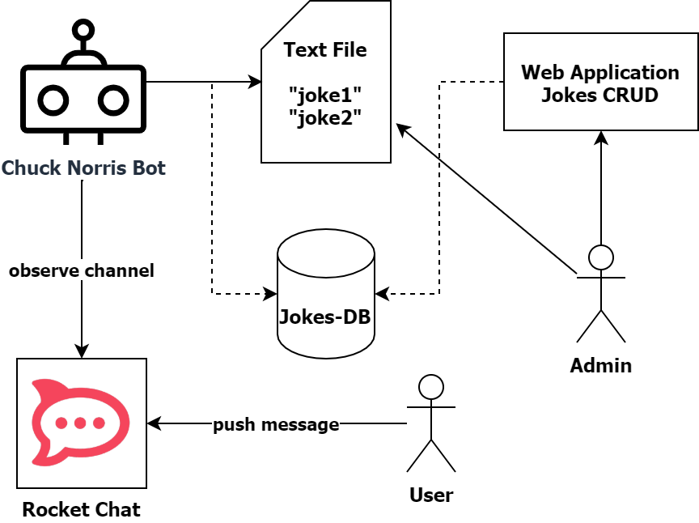

# Chuck Bot
The Chuck Bot should be able to read messages in a specific RocketChat Channel and react to the command **#whataboutchuck** with a fact about Chuck Norris life, like **Chuck Norris counted to infinity... twice**.

## Iterations of Chuck Bot

### Chuck Mocked
This is a simple Java project which mocks the retrieval and the pushing of jokes with in most simple Java with no dependencies.

#### Prerequisites
* Java 11+ SDK

#### Context
This project is the first interation of the Chuck Bot. There should be no dependencies except Java itself.

#### Goals
* Create a Java project structure (packages, classes).
* Run Java applications from an IDE.
* Create Mocks for missing functionality.
* Create Tests (with first TDD iteration).

### Chuck Bot Static Edition
This will be a fully functional Spring Boot Maven project with no UI or administration, but capable of reading from a real Rocket Chat server and pushing (random from a fixed set of jokes) jokes to a specific Channel on demand.

#### Prerequisites
* Java 11+ SDK
* Maven 3+
* Spring Boot 2+

#### Context
In the second iteration the Mock Bot should be replaced by a fully functioning Bot which integrates with Rocket Chat. It should be able to listen to commands and push responses to a Channel.

#### Goals
* Create a fully functional Spring Boot application.
* Create schedulers for scanning the Channels for commands.
* Create a persistent backend with Spring Data JPA for jokes.

### Chuck CRUD Bot with UI
This will be a fully functional Spring Boot Maven project a simple server-side rendered UI for administration of the jokes and capable of reading from a real Rocket Chat server and pushing (random from a fixed set of jokes) jokes to a specific Channel on demand.

#### Prerequisites
* Java 11+ SDK
* Maven 3+
* Spring Boot 2+

#### Context
In the third iteration it should be possible to administrate jokes in a CRUD way by using a web-UI implemented in Spring MVC.

#### Goals
* Create a fully functional Spring Boot MVC application.
* Create a Spring MVC application with administration functionality for jokes.

### Chuck Secure CRUD Bot
Same as CRUD Bot, but with a RBAC (with Spring Security) for joke administration.

#### Context
In the last iteration the administration should be extended to a secure role-based access CRUD with admin and user roles.

#### Goals
* Extend Spring Boot MVC application with Spring Security.
* Understand RBAC for web applications.

## Chuck Bot API

### Read all messages from channel (async, cron)
### Push joke to channel
### List all jokes
### (CRUD API)
#### Display joke
#### Add joke
#### (Modify joke)
#### Delete joke